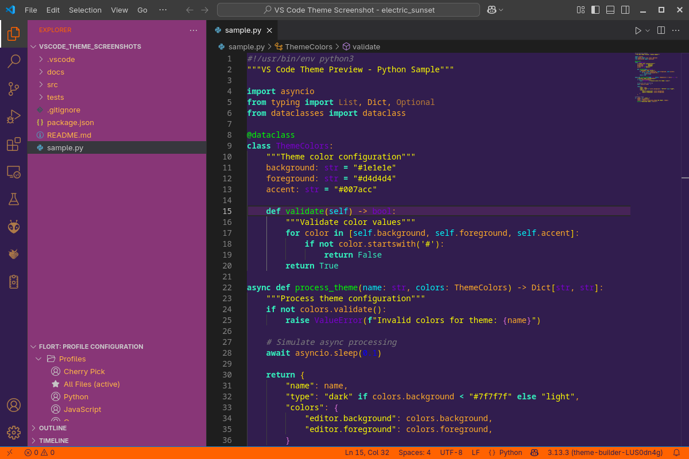
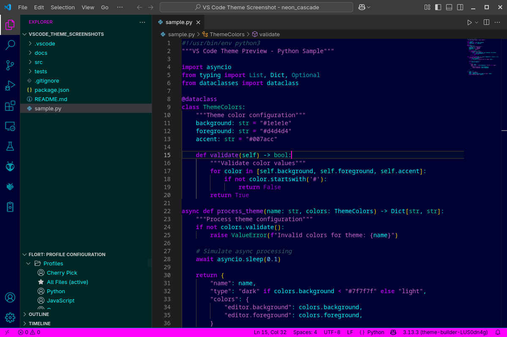
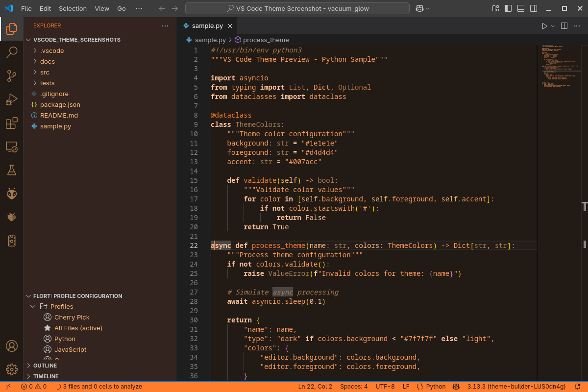

# WL Theme Collection

A collection of 50 cool, stylish, and retro VS Code themes.

## Theme Gallery

### WL-Acid Wash

---

### WL-Amber Monitor

---

### WL-Aurora Glow

---

### WL-Chrome Dreams

---

### WL-Chrome Noir

---

### WL-Circuit Board

---

### WL-Cosmic Drift

---

### WL-Crystal Cave

---

### WL-Cyber Punk

---

### WL-Cyber Rain

---

### WL-Data Stream

---

### WL-Dial Tone

---

### WL-Disco Ball

---

### WL-Electric Dreams

---

### WL-Electric Sunset

---

### WL-Fusion Core

---

### WL-Graffiti Wall

---

### WL-Hyper Drive

---

### WL-Ink Splash

---

### WL-Jade Temple

---

### WL-Laser Grid

---

### WL-Lava Lamp

---

### WL-Mainframe Blue

---

### WL-Midnight Drive

---

### WL-Misty Mountain

---

### WL-Moon Phase

---

### WL-Neon Cascade

---

### WL-Neon Sign

---

### WL-Neon Tokyo

---

### WL-Nova Burst

---

### WL-Pastel Dream

---

### WL-Pixel Punch

---

### WL-Plasma Storm

---

### WL-Prism Break

---

### WL-Pulse Wave

---

### WL-Punch Tape

---

### WL-Quantum Leap

---

### WL-Retro Arcade

---

### WL-Retro Future

---

### WL-Signal Wave

---

### WL-Silk Road

---

### WL-Solar Flare

---

### WL-Synthwave Rider

---

### WL-Tape Deck

---

### WL-Terminal Green

---

### WL-Turbo Boost

---

### WL-Vacuum Glow

---

### WL-Velvet Night

---

### WL-Volt Surge

---

### WL-Zen Twilight

---

## Installation

1. Open VS Code
2. Go to Extensions (Ctrl+Shift+X)
3. Search for the theme name
4. Click Install

## License

MIT License - See LICENSE file for details
